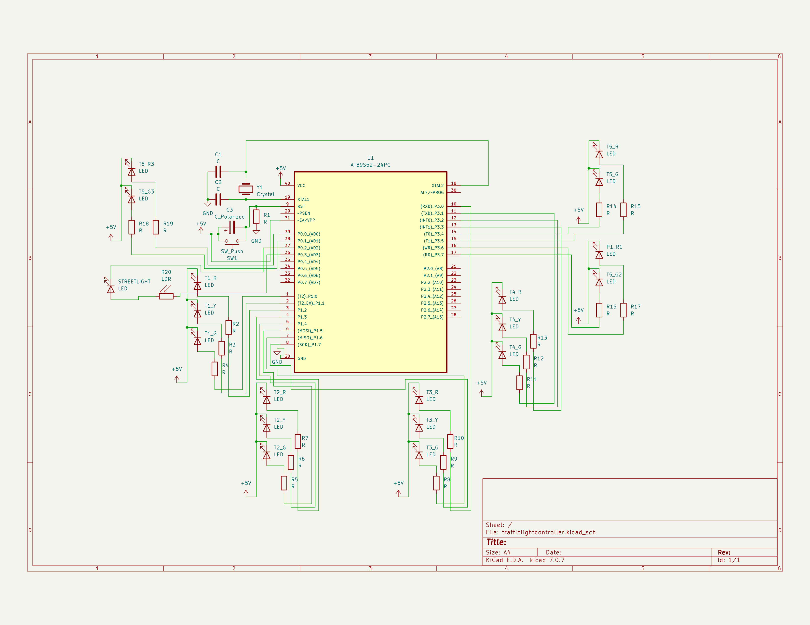

# 🚦Traffic Light Control System🚦

# **Introduction**

This documentation provides an overview of a **Traffic Light Control System** implemented using an **8051 microcontroller**. The system is designed to control a set of traffic lights and pedestrian lights at an intersection. It also includes a feature to adjust the intensity of streetlights based on the ambient light level sensed by a Light Dependent Resistor (LDR).

# Schematic Diagram



# **Hardware Components**

The project makes use of several essential hardware components to ensure its functionality. These components include:

- **8051 Microcontroller Development Board:** This development board acts as the brain of the project, providing the necessary processing power and control over various aspects of the system.
- **AT89S52 Microcontroller:** The AT89S52 microcontroller is a key component that works in conjunction with the development board to execute commands and facilitate communication between different parts of the project.
- **10mm LEDs for Traffic Lights & Pedestrian Signals:** To provide clear and visible indications for traffic lights and pedestrian signals, 10mm LEDs are integrated into the project. These LEDs emit bright and vibrant light, ensuring that the signals are easily visible to both drivers and pedestrians.
- **Light Dependent Resistor (LDR):** The inclusion of a light-dependent resistor in the project allows it to adapt and respond to changes in ambient light conditions. This enables the system to adjust the intensity of the LEDs based on the surrounding environment, ensuring optimal visibility and energy efficiency.
- **Resistors:** Resistors play a crucial role in regulating the flow of electrical current within the project. By carefully selecting and incorporating resistors of appropriate values, the system achieves the desired functionality and prevents any potential damage to the components.
- **Jumper Cables:** Jumper cables serve as the physical connections that link different components together, ensuring a seamless flow of data and power throughout the project. These cables provide flexibility and ease of assembly, allowing for efficient and reliable connections between the various hardware components.

By utilizing these carefully selected hardware components, the project is able to function effectively and deliver the desired results in a reliable and efficient manner.

# **Pin Connections**

### **LEDs for Traffic Lights**

- T1_R (Traffic Light 1 Red) - P1^2
- T1_Y (Traffic Light 1 Yellow) - P1^1
- T1_G (Traffic Light 1 Green) - P1^0
- T2_R (Traffic Light 2 Red) - P1^5
- T2_Y (Traffic Light 2 Yellow) - P1^4
- T2_G (Traffic Light 2 Green) - P1^3
- T3_R (Traffic Light 3 Red) - P3^0
- T3_Y (Traffic Light 3 Yellow) - P1^7
- T3_G (Traffic Light 3 Green) - P1^6
- T4_R (Traffic Light 4 Red) - P3^3
- T4_Y (Traffic Light 4 Yellow) - P3^2
- T4_G (Traffic Light 4 Green) - P3^1
- T5_R (Traffic Light 5 Red) - P3^5
- T5_G (Traffic Light 5 Green) - P3^4

### **LEDs for Pedestrian Signals**

- P1_R (Pedestrian Signal 1 Red) - P3^6
- P1_G (Pedestrian Signal 1 Green) - P3^7
- P2_R (Pedestrian Signal 2 Red) - P0^0
- P2_G (Pedestrian Signal 2 Green) - P0^1

### **Light Sensor and Output**

- LDR (Light Dependent Resistor) - P0^2
- LED (Streetlight LED) - P0^3

# **Code Structure**

```c
#include <reg51.h>	// Standard 8051 defines

sbit T1_R = P1^2;
sbit T1_Y = P1^1;
sbit T1_G = P1^0;

sbit T2_R = P1^5;
sbit T2_Y = P1^4;
sbit T2_G = P1^3;

sbit T3_R = P3^0;
sbit T3_Y = P1^7;
sbit T3_G = P1^6;

sbit T4_R = P3^3;
sbit T4_Y = P3^2;
sbit T4_G = P3^1;

sbit T5_R = P3^5;
sbit T5_G = P3^4;

sbit P1_R = P3^6;
sbit P1_G = P3^7;

sbit P2_R = P0^0;
sbit P2_G = P0^1;

sbit LDR = P0^2;
sbit LED = P0^3;
// Define Signal pins

// Initialize functions
void delay(unsigned int);
void streetlight();

void main()
{
	// Initialize traffic light states
  T1_R = T2_R = T3_R = T4_R = T5_R = 0;
  T1_Y = T2_Y = T3_Y = T4_Y = 0;
  T1_G = T2_G = T3_G = T4_G = T5_G = 0;
	P1_R = P2_R = 0;
	P1_G = P2_G = 0;
  delay(1000);
	T1_R = T2_R = T3_R = T4_R = T5_R = 0;
  T1_Y = T2_Y = T3_Y = T4_Y = 1;
  T1_G = T2_G = T3_G = T4_G = T5_G = 1;
	P1_R = P2_R = 1;
	P1_G = P2_G = 0;
	delay(1000);
	while(1)
		{
			T1_R = T5_R = P1_G = 1;
			T1_G = T5_G = P1_R = 0;
			streetlight();
			delay(5000);
			T1_G = 1;
			T1_Y = 0;
			streetlight();
			delay(3000);
			T1_Y = 1;
			T5_G = P1_R = 1;
			T1_R = T5_R = P1_G = 0;

			T2_R = 1;
			T2_G = 0;
			streetlight();
			delay(5000);
			T2_G = 1;
			T2_Y = 0;
			streetlight();
			delay(3000);
			T2_Y = 1;
			T2_R = 0;

			T3_R = 1;
			T3_G = 0;
			streetlight();
			delay(5000);
			T3_G = 1;
			T3_Y = 0;
			streetlight();
			delay(3000);
			T3_Y = 1;
			T3_R = 0;

			T4_R = P2_G = 1;
			T4_G = P2_R = 0;
			streetlight();
			delay(5000);
			T4_G = 1;
			T4_Y = 0;
			streetlight();
			delay(3000);
			T4_Y = P2_R = 1;
			T4_R = P2_G = 0;
		}
}

void delay(unsigned int a)
{
	unsigned int i,j;
	for(i=0;i<a;i++)
	{
		for(j=0;j<1275;j++)
		{
			streetlight();
		}
	}
}

void streetlight()
{
	if (LDR == 0)
	{
		LED = 0;
	}
	else
	{
		LED = 1;
	}
}
```

## **Header Files**

### **reg51.h**

The document includes the standard 8051 defines, which are essential for programming microcontrollers based on the 8051 architecture. These defines provide a set of predefined constants and macros that simplify the process of writing code for 8051 microcontrollers. By including these defines, developers can access various features and functionalities of the 8051 microcontroller, such as GPIO control, timer operations, and interrupt handling. Additionally, these defines enable compatibility and portability across different 8051-based microcontroller platforms, ensuring that the code can be easily adapted and reused. Overall, the inclusion of standard 8051 defines greatly enhances the programming experience and efficiency when working with 8051 microcontrollers.

## **Global Variables**

### **sbit**

The project involves the use of several pins, each representing a specific light or sensor used in the system. These declarations for the pins are crucial for the proper functioning and integration of the project components. Additionally, the pins serve as the interface between the hardware and software, allowing for seamless communication and data exchange. By accurately defining and assigning the pins, the project can effectively capture and process information from the various lights and sensors, enabling the desired functionalities and behavior of the system.

## Functions

### main()

- The **main** function serves as the entry point of the program. It initializes the states of the traffic lights and pedestrian signals to start the system. Afterwards, it enters an infinite loop to control the sequence of traffic lights and pedestrian signals.
- Within the **main** function, the traffic light states are initially set to all red, and the pedestrian signals are also set to red. This ensures that the intersection is in a safe state before the traffic light sequence begins.
- After the initial state setup, the program enters a while loop that continuously controls the traffic light sequence. The sequence follows a predefined pattern: each set of traffic lights transitions from red to yellow, then to green, and finally back to red.
- Additionally, the pedestrian signals are synchronized with the traffic lights to ensure pedestrian safety. When the traffic lights are green, the pedestrian signals display a red light, indicating that pedestrians should not cross. When the traffic lights transition to yellow, the pedestrian signals remain red as a precautionary measure. Finally, when the traffic lights turn red, the pedestrian signals switch to green, allowing pedestrians to cross the intersection safely.
- The traffic light sequence and synchronization with pedestrian signals are achieved by manipulating the corresponding pins that control the lights. The code uses conditional statements and delay functions to control the timing and transitions between different states.
- In addition to managing the traffic lights and pedestrian signals, the **main** function calls the **streetlight()** function. This function reads the ambient light level using a Light Dependent Resistor (LDR) and adjusts the intensity of the streetlights accordingly. If the LDR senses darkness, the streetlights are turned off to conserve power.
- To ensure proper functioning of the system, it is important to carefully adjust the delay values within the **delay()** function. These values determine the duration of each phase in the traffic light sequence and the synchronization with the pedestrian signals.
- Overall, the **main** function plays a crucial role in initializing and controlling the traffic light control system. It ensures the efficient flow of traffic and pedestrian safety at the intersection.

### **delay(unsigned int)**

This function generates a delay by looping for a specified number of iterations. It is commonly used for creating time delays in the program. By introducing this delay, the program can pause and wait for a certain period of time before proceeding to the next set of instructions. This is particularly useful in scenarios where synchronization or timing is crucial. For example, it can be employed to control the timing of animated effects, to simulate real-time interactions, or to ensure that certain processes occur in a specific order. Overall, the purpose of this function is to introduce a pause or wait period within the program's execution, allowing for better control and synchronization of actions.

### **streetlight()**

This function utilizes a Light Dependent Resistor (LDR) to measure the ambient light level. Based on the readings from the LDR, it controls the intensity of a streetlight by adjusting the LED brightness. The LED, which stands for Light Emitting Diode, is the key component responsible for illuminating the street. In order to conserve power during periods of darkness, the LED is automatically turned off by the system when the LDR detects low light levels.

# **Tasks for you - Modifying the Code**

If someone wants to modify the code without looking at the circuit, they should primarily focus on the following aspects:

## **Changing Traffic Light Sequences**

To modify the traffic light sequences or timings, locate the sections of code that manipulate the traffic light pins (T1_R, T1_Y, T1_G, etc.). By adjusting the delay values and logic within these sections, you can make changes to the traffic light sequences.

## **Pedestrian Signals**

The code utilizes P1_R, P1_G, P2_R, and P2_G to control pedestrian signals. Any changes to the sequences or timings of the pedestrian signals should be made in the corresponding sections of the code.

## **Streetlight Control**

The **streetlight()** function is responsible for controlling the streetlight based on the Light Dependent Resistor (LDR). Any changes to the streetlight behavior, depending on the ambient light levels, can be implemented within this function.

## **Delay Timings**

Adjusting the delay values in the **delay()** function will affect the timing of the traffic light and pedestrian signal sequences. Modifying these values allows for control over the duration of each phase.

## **Conditional Logic**

The conditional statements in the main loop of the code determine the sequence of traffic lights and pedestrian signals. Modifying these conditions will alter the order of operation.

## **Adding Features**

To add new features or functionalities, you will need to define additional pins and corresponding code sections. It is important to ensure that the pin connections match the physical circuit.

## **Debugging and Testing**

Whenever code modifications are made, it is important to conduct thorough testing to ensure that the sequences of traffic lights, pedestrian signals, and streetlight control behave as expected.

In summary, when modifying the code without considering the circuit, attention should be given to the pin connections and code sections that manipulate the relevant pins for traffic lights, pedestrian signals, and streetlights. It is crucial to maintain consistency between code changes and the physical circuit to ensure proper functionality.

# **Conclusion**

The Traffic Light Control System showcased in this project utilizes an 8051 microcontroller to effectively manage traffic lights, pedestrian signals, and streetlights. The primary objectives of this project are to ensure smooth traffic flow, prioritize pedestrian safety, and minimize power consumption for streetlights.

[](https://vpteduin8928-my.sharepoint.com/personal/tanishq_mudaliar_vpt_edu_in/_layouts/15/embed.aspx?UniqueId=6650946f-b0c6-4263-98de-7c38a62a2560&embed=%7B%22ust%22%3Atrue%2C%22hv%22%3A%22CopyEmbedCode%22%7D&referrer=StreamWebApp&referrerScenario=EmbedDialog.Create)
